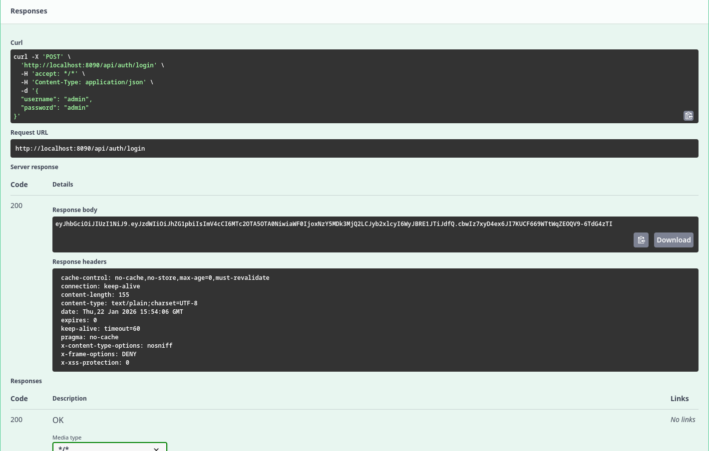
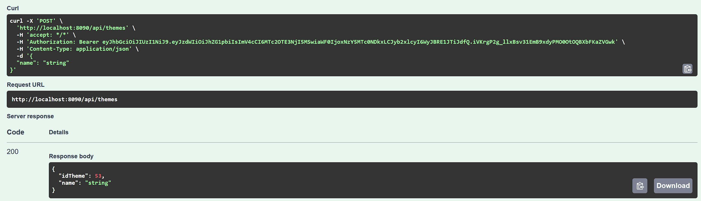
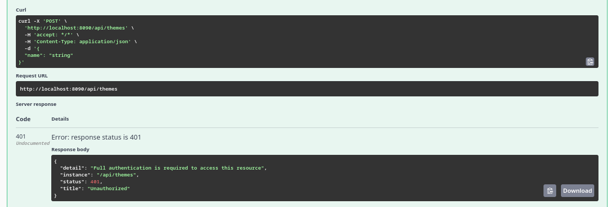
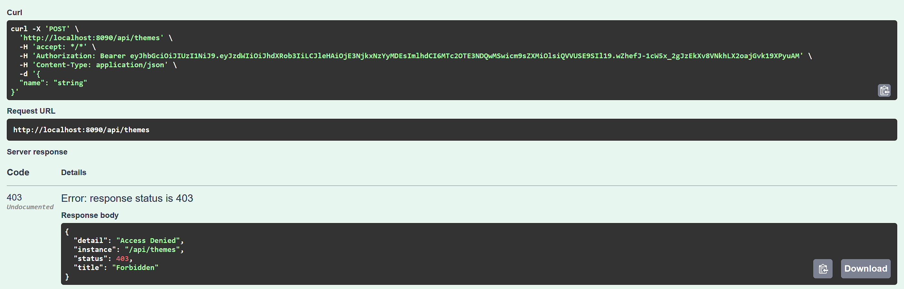
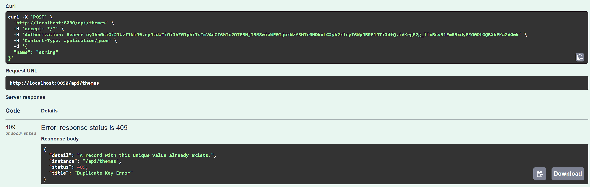
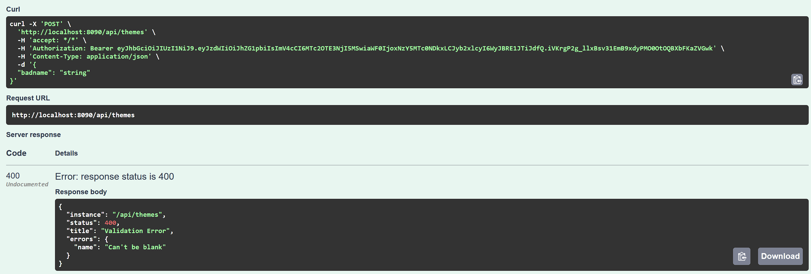

# TP Java SpringBoot

- Utilise PostgreSQL comme base de données
- `docker compose up` pour start la base de données

# Membres de l'équipe

- BARBE Enora
- CALU Maxime
- CHARNET Benjamin
- RUSALEN Mattéo

# Screenshots

## Login success

## Theme creation success

## Theme creation unauthorized (no token)

## Theme creation forbidden (when role not ADMIN)

## Theme creation fail (unique constraint)

## Theme bad request
